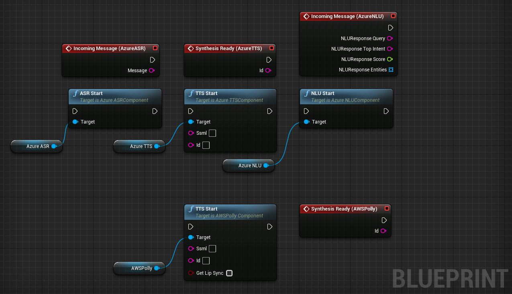

<!--[![Stargazers][stars-shield]][stars-url] -->

<!-- PROJECT LOGO -->
 

  

  <h3 align="center">Framework for Advanced Natural Tools and Applications with Social Interactive Agents</h3>

  

    An Unreal Engine set of tools to build Embodied Conversational Agents using easy, Blueprint based, interfaces towards powerful AI technologies.
     
     
    <a href="https://forums.unrealengine.com/t/framework-for-advanced-natural-tools-and-applications-with-social-interactive-agents-fantasia/158706">Forum thread</a>
    ·
    <a href="https://www.youtube.com/channel/UChH-PYQw-_IZJM7nYJywevg">Youtube channel</a>
    ·
	 
	<a href="https://github.com/antori82/FANTASIATemplate">FANTASIA Interaction Model demo project</a>
	.
  

<!-- TABLE OF CONTENTS -->

  
<h2 style="display: inline-block">Table of Contents</h2>

  <ol>
    <li>
      <a href="#about">About FANTASIA</a>
    </li>
    <li>
      <a href="#installation">Installation</a>
      <ul>
        <li><a href="#prerequisites">Prerequisites</a></li>
        <li><a href="#installation">Installation</a></li>
      </ul>
    </li>
    <li><a href="#license">License</a></li>
    <li><a href="#contact">Contact</a></li>
    <li><a href="#acknowledgements">Acknowledgements</a></li>
  </ol>

<!-- ABOUT THE PROJECT -->
## About The Project

 
 
 

FANTASIA is a collection of tools for UE that we have developed over the years to work with Embodied Conversational Agents at the University of Padua and at the University of Naples Federico II in Italy. Since we have been working with different characters for different tasks, I developed these tools so that the functionalities characterizing one agent could be easily transferred to others. Since we have done this multiple times with minimal effort, now, and since there appears to be an increasing interest towards Virtual Humans in UE, we decided to take all the dirty code we have and re-engineer it so that we could distribute it to the community. We hope it will be helpful for other colleagues in the academy but we also hope it will help people, in general, produce amazing stuff.

### Installation

1. Clone or download the repository.
2. If not already present, create a folder named "Plugins" in your PROJECT
3. Copy the contents of the FANTASIA folder from the repository to the Plugins folder
4. Launch UE. You should see FANTASIA listed in the Plugins list

## Notes

If you get an error stating that your project cannot be launched because of FANTASIA, please check that the dll files included in the ThirdParty->Redist folder of the repository have been copied where your project's binaries are found. These should be under Binaries->Win64. If the dll files are not there, please copy them manually. FANTASIA currently uses dynamically linked libraries from Microsoft and Amazon to access services exposed to Blueprints.

## Citing FANTASIA

If you use FANTASIA for your research, please cite the following papers in your publications

Origlia, A., Cutugno, F., Rodà, A., Cosi, P., & Zmarich, C. (2019). FANTASIA: a framework for advanced natural tools and applications in social, interactive approaches. Multimedia Tools and Applications, 78(10), 13613-13648.

Origlia, A., Di Bratto, M., Di Maro, M., & Mennella, S. (2022). Developing Embodied Conversational Agents in the Unreal Engine: The FANTASIA Plugin. In Proceedings of the 30th ACM International Conference on Multimedia (pp. 6950-6951).

## Projects using FANTASIA

<a href="https://www.specialprojectunina.com/"><strong>SPECIAL</strong></a> - Supporting Patients with Embodied Conversational Interfaces and Argumentative Language (funded by the University of Naples Federico II): developing a Virtual Human to increase health literacy and fight stereotypes about epilepsy.

<a href="https://www.logogramma.com/artificial-intelligence/progetti-di-ricerca-e-sviluppo-sperimentale-co-finanziati/visit3d/"><strong>VISIT3D</strong></a> - Logogramma S.r.l. in collaboration with URBAN/ECO Research Center (University of Naples Federico II): developing a Virtual Reality guide for reflection about visual arts.

<!-- CONTACT -->
## Contact

Antonio Origlia - antonio.origlia [at] unina.it

Project Link: [https://github.com/antori82/FANTASIA](https://github.com/antori82/FANTASIA)

[Youtube channel](https://www.youtube.com/channel/UChH-PYQw-_IZJM7nYJywevg)

[Unreal Engine Forum discussion page](https://forums.unrealengine.com/t/framework-for-advanced-natural-tools-and-applications-with-social-interactive-agents-fantasia/158706) 

<!-- ACKNOWLEDGEMENTS -->
## Acknowledgements

FANTASIA would not be the same without the precious contribution from the Linguistics field provided by

* <a href="https://www.linkedin.com/in/maria-di-maro-b43261120/">Dr. Maria Di Maro</a> - (PhD) Common ground management and Clarification Requests generation
* <a href="https://www.linkedin.com/in/martina-di-bratto-95034322b/">Dr. Martina Di Bratto</a> - (PhD) Argumentative Dialogue Management

Special thanks to the students who contributed to FANTASIA

* <a href="https://www.linkedin.com/in/antimo-de-biase-3660b6202/">Antimo De Biase</a> - Neo4j component prototype development
* Fabrizio Musella - aGrUM integration prototype development
* <a href="https://www.linkedin.com/in/rbgdotbrush/">Roberto Basile Giannini</a> - General improvements and aGrUM updates (Influence Diagrams integration)
* <a href="https://www.linkedin.com/in/marco-galantino-232a07300">Marco Galantino</a> - TTS General interface
* <a href="https://www.linkedin.com/in/yegor-napadystyy-b5482b2bb/">Yegor Napadystyy</a> - Audio2Face prototype connector
* <a href="https://www.linkedin.com/in/lorenzo-bracale-6001b1331/">Lorenzo Bracale</a> - Prolog component prototype development
* <a href="https://www.linkedin.com/in/danierspo/">Danilo Esposito</a> - First implementation of the logical/bayesian backbone for the FANTASIA Interaction Model
* Raffaele Di Maso - Advanced implementation of the logical/bayesian backbone for the FANTASIA Interaction Model

<!-- MARKDOWN LINKS & IMAGES -->
<!-- https://www.markdownguide.org/basic-syntax/#reference-style-links -->
[stars-shield]: https://img.shields.io/github/stars/github_username/repo.svg?style=for-the-badge
[stars-url]: https://github.com/antori82/FANTASIA/stargazers
[license-shield]: https://img.shields.io/github/license/github_username/repo.svg?style=for-the-badge
[license-url]: https://github.com/github_username/repo/blob/master/LICENSE.txt
