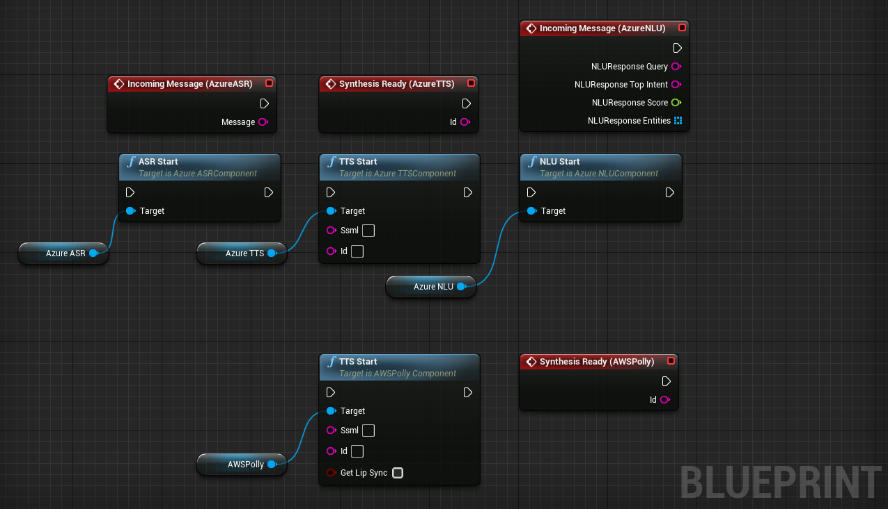

<!-- PROJECT LOGO -->
 

  

  <h3 align="center">FANTASIA</h3>
  
<i>Framework for Advanced Natural Tools and Applications with Social Interactive Agents</i>

  

    A batteries-included Unreal Engine plugin for building Embodied Conversational Agents — speech, language, reasoning and graph data, all reachable from Blueprints.
     
     
    <a href="https://github.com/antori82/FANTASIA/wiki"><strong>Documentation Wiki »</strong></a>
    ·
    <a href="https://codeberg.org/antori/FANTASIA-LangGraphDemo">LangGraph Demo Project</a>
    ·
    <a href="https://forums.unrealengine.com/t/framework-for-advanced-natural-tools-and-applications-with-social-interactive-agents-fantasia/158706">Forum</a>
    ·
    <a href="https://www.youtube.com/channel/UChH-PYQw-_IZJM7nYJywevg">YouTube</a>
  

<!-- TABLE OF CONTENTS -->

  
<h2 style="display: inline-block">Table of Contents</h2>

  <ol>
    <li><a href="#about-the-project">About the Project</a></li>
    <li><a href="#whats-in-the-box">What's in the Box</a></li>
    <li><a href="#quick-start">Quick Start</a></li>
    <li><a href="#installation">Installation</a></li>
    <li><a href="#troubleshooting">Troubleshooting</a></li>
    <li><a href="#citing-fantasia">Citing FANTASIA</a></li>
    <li><a href="#projects-using-fantasia">Projects using FANTASIA</a></li>
    <li><a href="#contact">Contact</a></li>
    <li><a href="#acknowledgements">Acknowledgements</a></li>
  </ol>

<!-- ABOUT THE PROJECT -->
## About the Project

  

FANTASIA is a collection of tools for Unreal Engine that we have developed over the years to work with Embodied Conversational Agents at the University of Padua and at the University of Naples Federico II in Italy. Because we have been working with different characters for different tasks, we built these tools so that the functionalities of one agent could be transferred to another with minimal effort. Given the growing interest in Virtual Humans on UE, we decided to take all the dirty code we had, re-engineer it, and ship it to the community. We hope it will be useful to colleagues in academia, and we hope it will help anyone produce amazing things.

The plugin exposes everything through Blueprint-friendly Actor Components and UObjects, so you can wire up a full conversational pipeline — speech in, reasoning, speech out — without writing C++.

## What's in the Box

FANTASIA bundles a set of independent components. Use only what you need.

### Speech

| Component | Purpose |
| --- | --- |
| **Whisper ASR** | Local, on-device speech-to-text via [whisper.cpp](https://github.com/ggerganov/whisper.cpp). Optional CUDA GPU acceleration. Real-time microphone capture with VAD and streaming modes. |
| **ElevenLabs TTS** | Streaming text-to-speech via REST. |
| **Generic REST TTS** | Base class for plugging in any HTTP TTS service. |

### Language Models

| Component | Purpose |
| --- | --- |
| **OpenAI-Compatible LLM** | One component for OpenAI, Groq, Ollama, LM Studio, vLLM, and any other OpenAI-compatible API. Streaming and non-streaming, with Blueprint presets. |
| **LangGraph** | Drive a remote LangGraph workflow as a conversational agent. |

### Reasoning

| Component | Purpose |
| --- | --- |
| **SWI-Prolog** | Embedded Prolog engine. Assert/retract facts, run queries, build terms from Blueprints. |
| **Bayesian Networks** | Probabilistic inference using [aGrUM](https://agrum.gitlab.io/) (Lazy Propagation, Shafer-Shenoy, Variable Elimination). |
| **Influence Diagrams** | Decision-making under uncertainty using [aGrUM](https://agrum.gitlab.io/) (Shafer-Shenoy LIMID inference). |

### Data

| Component | Purpose |
| --- | --- |
| **Neo4j** | Cypher queries against a Neo4j graph database via the native Bolt protocol (WebSocket or TCP+TLS). |

### Math & ML

| Component | Purpose |
| --- | --- |
| **SVM** | Train and predict with Support Vector Machines via [libsvm](https://www.csie.ntu.edu.tw/~cjlin/libsvm/). |
| **Kernel Density Estimator** | Non-parametric PDF estimation. |

### Animation

| Integration | Purpose |
| --- | --- |
| **NVIDIA ACE** *(optional)* | Audio-driven facial animation via the [NVIDIA ACE Reference plugin](https://developer.nvidia.com/ace). When ACE is present, TTS audio drives lip-sync and emotion. |

## Quick Start

The fastest way to see FANTASIA running is the demo project:

> **[FANTASIA-LangGraphDemo](https://codeberg.org/antori/FANTASIA-LangGraphDemo)** — a ready-to-run UE project wiring LangGraph + Whisper + ElevenLabs into a working Conversational AI pipeline. Clone, open, hit play.

If you want to start from scratch, install the plugin into your own project (next section) and consult the [Wiki](https://github.com/antori82/FANTASIA/wiki) for component-by-component setup guides.

## Installation

FANTASIA is distributed prebuilt — for most users, no compilation is required.

1. Clone or download this repository.
2. If your UE project does not already have one, create a `Plugins` folder at the project root.
3. Copy the `FANTASIA` folder from this repository into that `Plugins` folder.
4. Launch Unreal Engine. FANTASIA should appear in the **Plugins** list.

### When a rebuild *is* needed

The shipped DLL is built for the most common configuration. You will need a one-time C++ rebuild if you want either of these:

- **NVIDIA ACE lip-sync** — the prebuilt DLL omits ACE bindings so the plugin loads on systems without ACE installed. To enable ACE, follow the rebuild instructions in the Wiki.
- **Whisper with CUDA** — the prebuilt DLL uses CPU inference. To enable GPU acceleration, follow the CUDA build instructions in the Wiki.

> **See the [Wiki](https://github.com/antori82/FANTASIA/wiki) for the current installation procedure.** This rebuild requirement will be lifted once we migrate to UE 5.7.

## Troubleshooting

If the editor reports that your project cannot be launched because of FANTASIA, verify that the third-party DLLs in `ThirdParty/Redist/` have been copied to your project's `Binaries/Win64/` folder. Some FANTASIA components rely on dynamically linked libraries from Microsoft, Amazon, and other vendors that must sit alongside your project's binaries. If they are missing, copy them manually.

For component-specific problems (API keys, microphone permissions, model file locations, etc.), see the [Wiki](https://github.com/antori82/FANTASIA/wiki).

## Citing FANTASIA

If you use FANTASIA for your research, please cite the following papers:

> Origlia, A., Cutugno, F., Rodà, A., Cosi, P., & Zmarich, C. (2019). FANTASIA: a framework for advanced natural tools and applications in social, interactive approaches. *Multimedia Tools and Applications*, 78(10), 13613–13648.

> Origlia, A., Di Bratto, M., Di Maro, M., & Mennella, S. (2022). Developing Embodied Conversational Agents in the Unreal Engine: The FANTASIA Plugin. *Proceedings of the 30th ACM International Conference on Multimedia*, 6950–6951.

## Projects using FANTASIA

- **[SPECIAL](https://www.specialprojectunina.com/)** — Supporting Patients with Embodied Conversational Interfaces and Argumentative Language (funded by the University of Naples Federico II): a Virtual Human to increase health literacy and combat stereotypes about epilepsy.
- **[VISIT3D](https://www.logogramma.com/artificial-intelligence/progetti-di-ricerca-e-sviluppo-sperimentale-co-finanziati/visit3d/)** — Logogramma S.r.l. in collaboration with the URBAN/ECO Research Center (University of Naples Federico II): a Virtual Reality guide for reflection on the visual arts.

If you build something with FANTASIA we'd love to hear about it — open an issue or get in touch.

<!-- CONTACT -->
## Contact

**Antonio Origlia** — antonio.origlia [at] unina.it

- Project: [github.com/antori82/FANTASIA](https://github.com/antori82/FANTASIA)
- Wiki: [github.com/antori82/FANTASIA/wiki](https://github.com/antori82/FANTASIA/wiki)
- YouTube: [Project channel](https://www.youtube.com/channel/UChH-PYQw-_IZJM7nYJywevg)
- Forum: [Unreal Engine discussion](https://forums.unrealengine.com/t/framework-for-advanced-natural-tools-and-applications-with-social-interactive-agents-fantasia/158706)

<!-- ACKNOWLEDGEMENTS -->
## Acknowledgements

FANTASIA would not be the same without the precious contribution from the Linguistics field provided by:

- [Dr. Maria Di Maro](https://www.linkedin.com/in/maria-di-maro-b43261120/) — (PhD) Common ground management and clarification request generation
- [Dr. Martina Di Bratto](https://www.linkedin.com/in/martina-di-bratto-95034322b/) — (PhD) Argumentative dialogue management

Special thanks to the students who contributed to FANTASIA:

- [Antimo De Biase](https://www.linkedin.com/in/antimo-de-biase-3660b6202/) — Neo4j component prototype development
- Fabrizio Musella — aGrUM integration prototype development
- [Roberto Basile Giannini](https://www.linkedin.com/in/rbgdotbrush/) — General improvements and aGrUM updates (Influence Diagrams integration)
- [Marco Galantino](https://www.linkedin.com/in/marco-galantino-232a07300) — TTS general interface
- [Yegor Napadystyy](https://www.linkedin.com/in/yegor-napadystyy-b5482b2bb/) — Audio2Face prototype connector
- [Lorenzo Bracale](https://www.linkedin.com/in/lorenzo-bracale-6001b1331/) — Prolog component prototype development
